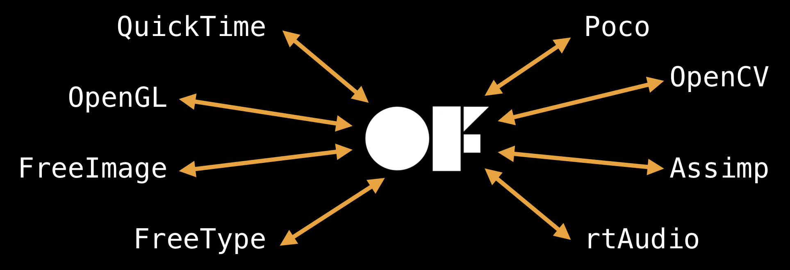

## What is openFrameworks?

[openFrameworks](https://openframeworks.cc/) (OF) is an open source cross-platform C++ toolkit designed to assist the creative process, by providing a simple and intuitive framework for experimentation.

OF is distributed under the MIT License, which gives everyone the freedoms to use openFrameworks in any context:

* Commercial or non-commercial.
* Public or private.
* Open or closed source.

### What is C++?

* A programming language.
* General purpose.
* Fairly low level, but can be programmed in a high level way.
* Compiled (it's really fast).
* Widely used.

### Libraries

OF is written in C++. It makes it easier to interface with the many libraries that have been written in C and C++ without needing to rely on a wrapper for another language.

Libraries are collections of code that do something common or useful. For example:

* [OpenGL](https://opengl.org/) for drawing graphics.
* [FreeType](https://www.freetype.org/) for loading and rendering fonts.
* [FreeImage](http://freeimage.sourceforge.net/) for loading image files.
* [AVFoundation](https://developer.apple.com/av-foundation/) for playing videos.

OF is the glue that ensures these libraries work together well.



It is a consistent and intuitive interface to these libraries.

For example, loading a font using FreeType directly would look something like this:

```cpp
FT_New_Face(...);
FT_Set_Char_Size(...);
```

And with OF would look like this:

```cpp
ofTrueTypeFont font;
font.load(...);
```

Loading an image using FreeImage directly:

```cpp
FreeImage_OpenMemory(...);
FreeImage_LoadFromMemory(...);
FreeImage_GetBits(...);
```

And with OF:

```cpp
ofImage img;
img.load(...);
```

### Open Source

OF is distributed as source code.

* An open book, giving the curious a good starting point for learning about C++ library wrangling.
* A work in progress, keeping the code visible allowing for easier changes and feedback.
* An invitation for users to modify the toolkit to their taste or needs.

Over 70 people have contributed to the core, and there are more than 1500 addons extending the base functionality of the toolkit.

### Comparisons with Processing

openFrameworks and Processing have many similarities. In fact, OF is inspired by Processing!

When possible, openFrameworks tries to maintain parity with Processing, making moving from one to the other very easy. Compare the following code snippets:

```java
void setup()
{
  frameRate(60);
  background(0);
}

void draw()
{
  fill(255, 0, 0);
  rect(10, 10, 50, 50);
}
```

```cpp
void ofApp::setup()
{
  ofSetFrameRate(60);
  ofBackground(0);
}

void ofApp::draw()
{
  ofSetColor(255, 0, 0);
  ofDrawRectangle(10, 10, 50, 50);
}
```


**What does the <code>::</code> mean?**

`::` is a scope resolution operator in C++. It is used to show the relationship between methods (functions) and classes. Methods can be defined anywhere in the source code, so we need a way to know where they belong when they are defined.

For example, `void ofApp::draw()` means "define the `draw()` function that belongs to the `ofApp` class".


## Getting Started

### Installation

[Download](https://openframeworks.cc/download/) the openFrameworks package for your environment.

Follow the corresponding setup guide.

* Unlike Processing, OF does not come with its own development environment (IDE). Instructions to set this up will be included in the guide.
* You will use [Xcode](https://developer.apple.com/xcode/) for development under macOS and [Visual Studio](https://visualstudio.microsoft.com/vs/) for development under Windows.
* Please refer to the [Getting Started]() page for details.


If you encounter a build system error when compiling for Xcode, try changing the `Build System` dropdown in the Project Settings.




### Project Generation

To create a new project, you are **strongly encouraged** to use the OF Project Generator.

* This application can be found in your downloaded package, under `/path/to/OF/projectGenerator-XXX`.
* The Project Generator will take care of adding any files and libraries needed to build your applications.

The first time you run the Project Generator, you'll be asked to set the path to the openFrameworks installation on your system.



You can then create a project by giving it a name and a save path. It is recommended to save your projects under `path/to/OF/apps/seeing-machines/`.



Click `Generate` to create the project files. Once that is complete, you can click on the `Open in IDE` button to open the project.



### Anatomy of an OF Project

A basic OF project will include three files you can edit.

`main.cpp` contains the `main()` function. This is the entry point to the program.

The main function is where the application window is set. You can set up the window dimensions, renderer used, graphics quality, additional windows, etc.

```cpp
#include "ofMain.h"
#include "ofApp.h"

int main()
{
  ofSetupOpenGL(1920, 1080, OF_WINDOW);
  ofRunApp(new ofApp());
}
```


**What does <code>#include</code> mean?**

The `#` symbol is used to indicate a compiler directive. When a file has the line `#include "someFile.h"`, this tells the compiler to insert the code from that specific file into the source code.

If we want to use any classes or functions defined in other files, we need to `#include` these in our code so that the compiler knows where to look for them.


The other two files define the `ofApp` class. You can think of `ofApp` as the main class that holds and runs all the components belonging to your program, kind of like a sketch in Processing.

In C++, classes are defined in two parts: the header (declaration) and the implementation (definition). The header defines *what* a class is, and the implementation defines *how* a class operates.

The header will usually have extension `.h` or `.hpp`. This is where all variables and methods in the class are listed. You can think of this as a table of contents for the class. When classes link to each other using `#include`, they will only refer to the header class as they only need to "know" what variables and methods are available to them, but not how these are implemented. This reduces dependencies and in turn compilation times.

```cpp
#pragma once

#include "ofMain.h"

class ofApp : public ofBaseApp
{
public:
  void setup();
  void update();
  void draw();

  void keyPressed(int key);
  void keyReleased(int key);
  void mouseMoved(int x, int y);
  void mouseDragged(int x, int y, int button);
  void mousePressed(int x, int y, int button);
  void mouseReleased(int x, int y, int button);
  void mouseEntered(int x, int y);
  void mouseExited(int x, int y);
  void windowResized(int w, int h);
  void dragEvent(ofDragInfo dragInfo);
  void gotMessage(ofMessage msg);
};
```


**What does <code>#pragma once</code> mean?**

We now know `#include` will insert the contents of another file into our code, however we only want to include every piece of code once in our application. You will notice many files will have `#include "ofMain.h"` at the top, but that code cannot be inserted over and over, as this will give us duplicate classes and functions with the same name.

This is where the `#pragma once` directive comes in. It tells the compiler to only include the contents of the file once, no matter how many times it is referenced with `#include`.

As a general rule, you should always start your header files with the line `#pragma once`.


The implementation will have extension `.cpp`. This is where all the methods declared in the header are defined.

```cpp
#include "ofApp.h"

void ofApp::setup() 
{
  // Called once at app startup.
}

void ofApp::update()
{
  // Called at the start of every frame.
}

void ofApp::draw()
{
  // Called every frame after update.
}

void ofApp::keyPressed(int key) 
{
  // Called when a key is pressed.
}

void ofApp::keyReleased(int key) 
{
  // Called when a key is released.
}

void ofApp::mouseMoved(int x, int y) 
{
  // Called when the mouse is moved and no buttons are pressed.
}

void ofApp::mouseDragged(int x, int y, int button) 
{
  // Called when the mouse is moved while a button is pressed down.
}

void ofApp::mousePressed(int x, int y, int button) 
{
  // Called when a mouse button is pressed.
}

void ofApp::mouseReleased(int x, int y, int button) 
{
  // Called when a mouse button is released.
}

void ofApp::mouseEntered(int x, int y) 
{
  // Called when the mouse cursor enters the application window.
}

void ofApp::mouseExited(int x, int y) 
{
  // Called when the mouse cursor exits the application window.
}

void ofApp::windowResized(int w, int h) 
{
  // Called when the application window is resized.
}

void ofApp::gotMessage(ofMessage msg) 
{
  // I have no idea :/
}

void ofApp::dragEvent(ofDragInfo dragInfo) 
{
  // Called when a file or set of files are dragged onto the application window.
}
```

Note that the placeholder `ofApp` already has stubs for common methods you may want to use. You can keep these in or delete them, but if you get rid of them you'll need to do so in both the header and the implementation files.

### Reference

OF ships with a multitude of examples in the `path/to/OF/examples` folder, and this is the best way to get familiar with the tool. Note that project files need to be created for these using the Project Generator before they can be built.

OF also has comprehensive [documentation](https://openframeworks.cc/documentation/) on its website, as well as an active [user forum](https://forum.openframeworks.cc/), which are other great places to get information.
