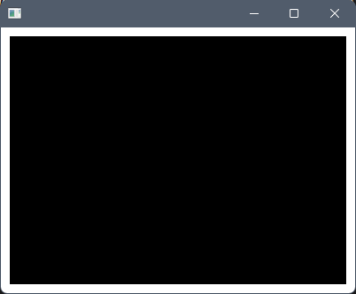
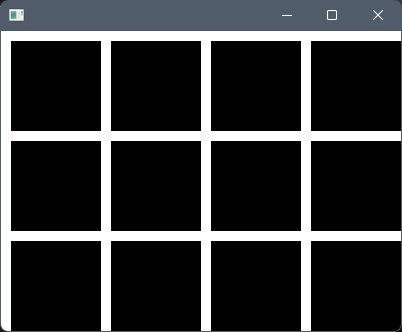

## Array Access

Arrays are used to store multiple values of the same type under a single variable (vs declaring one variable per value).

```cpp
// An array containing 10 integers (uninitialized).
int values[10];
```

Array elements are accessed using the square bracket `[]` operator. We can pass in an index to access the corresponding element in the array. Note that arrays are `0`-indexed (the index of the first element is `0`) in C++.

```cpp
int values[10];
for (int i = 0; i < 10; i++)
{
  values[i] = i + 1;
}
```



## Strings as Arrays

A `string` is an array of `char` under the hood (along with some extra functionality). Each character in a `string` is an element in the array and can be accessed using the `[]` notation.



```cpp
string name = "John Doe";
cout << "The name '";
for (int i = 0; i < name.size(); i++)
{
  cout << name[i];
}
cout << "' has " << name.size() << " characters" << endl;
```





## 2D Arrays

Arrays of other arrays are called multidimensional arrays. Instead of each array position holding a single element, it holds an entire array of elements.

Although arrays can have any number of dimensions, we will most often work with two-dimensional arrays.

```cpp
// An array containing 10 arrays each containing 2 integers (uninitialized).
int values[10][2];
```

Array elements are accessed using multiple square brackets `[][]` (one per dimension). Nested for-loops can be used to access all the elements.

```cpp
int values[10][2];  // 10 columns by 2 rows
for (int y = 0; y < 2; y++)
{
  for (int x = 0; x < 10; x++)
  {
    values[x][y] = x + y;
  }
}
```





We need to consider each dimension separately as columns and rows, and look at the array as "columns of rows". To access a row index (`0-1`), we always need to add the column offset first (`0-9`). Each column has `10` rows, so the offset must be multiplied by 10.

```cpp
int values[10][2];  // 10 columns by 2 rows
for (int y = 0; y < 2; y++)
{
  for (int x = 0; x < 10; x++)
  {
    values[x][y] = y * 10 + x;
  }
}
```







We can use the [`ofRandomuf()`](https://openframeworks.cc/documentation/math/ofMath/#!show_ofRandomuf) OF function, which returns a random value between `0` and `1` (the "uf" stands for unsigned float). We will set our element to `false` if the random value is less than `0.5`, and set it to `true` if the value is greater than `0.5`.

```cpp
bool values[40][30];

// Fill the 2D array with 0s and 1s.
for (int y = 0; y < 30; y++)  // rows
{
  for (int x = 0; x < 40; x++)  // columns
  {
    if (ofRandomuf() < 0.5)
    {
        values[x][y] = false;
    }
    else
    {
        values[x][y] = true;
    }
  }
}
```

To output the values as a grid, we can once again use nested for-loops to go through the 2D array, print out the characters one at a time, and print out a new line whenever we increment the row index.

```cpp
// Read back the values as a grid.
for (int y = 0; y < 30; y++)  // rows
{
  for (int x = 0; x < 40; x++)  // columns
  {
    cout << values[x][y];
  }
  cout << endl;  // Add a new line after every row.
}
```





We can draw a cell for each grid position using [`ofDrawRectangle(...)`](https://openframeworks.cc/documentation/graphics/ofGraphics/#!show_ofDrawRectangle), setting the color for each cell in the loop using [`ofSetColor(...)`](https://openframeworks.cc/documentation/graphics/ofGraphics/#show_ofSetColor).

```cpp
// Draw the array as a grid.
int gridSize = 10;
for (int y = 0; y < 30; y++)  // rows
{
  for (int x = 0; x < 40; x++)  // columns
  {
    if (values[x][y])
    {
      ofSetColor(255);
    }
    else
    {
      ofSetColor(0);
    }
    ofDrawRectangle(x * gridSize, y * gridSize, gridSize, gridSize);
  }
}
```





* The left edge elements have their column index set to `0`.
* The top edge elements have their row index set to `0`.
* The right edge elements have their column index set to the number of columns (the width) minus 1. In our case, this is `39`.
* The bottom edge elements have their row index set to the number of rows (the height) minus 1. In our case, this is `29`.

If any of the above conditions are `true`, our value should also be `true`.

```cpp
for (int y = 0; y < 30; y++)  // rows
{
  for (int x = 0; x < 40; x++)  // columns
  {
    if (x == 0 || y == 0 || x == 39 || y == 29)
    {
      values[x][y] = true;
    }
    else
    {
      values[x][y] = false;
    }
    
    // The following does the same thing as a single line of code.
    //values[x][y] = (x == 0 || y == 0 || x == 39 || y == 29);
  }
}
```





We want every 10th element in each direction to be `true`, and the remaining values to be `false`. We can use the modulo `%` operator, which is ideal for whenever we want to count things periodically (e.g. every X count, do something).

```cpp
for (int y = 0; y < 30; y++)  // rows
{
  for (int x = 0; x < 40; x++)  // columns
  {
    if (x % 10 == 0 || y % 10 == 0)
    {
      values[x][y] = true;
    }
    else
    {
      values[x][y] = false;
    }
    
    // The following does the same thing as a single line of code.
    //values[x][y] = (x % 10 == 0 || y % 10 == 0);
  }
}
```

We do not end up with a border on the right or the bottom because `39` and `29` are not divisible by `10`. If this is something we wanted, one option would be to increase our 2D array size to 41 by 31, making the last column index `40` and the last row index `30`.


## 1D to 2D Interpretation

There is no difference in computer between a 1D and a 2D array, they are both just many indexed elements in sequence.

We could re-write some of our previous examples using a one-dimensional array, but using two-dimensional access.

```cpp
bool values[40*30];

// Fill the 2D array with 0s and 1s.
for (int y = 0; y < 30; y++)  // rows
{
  for (int x = 0; x < 40; x++)  // columns
  {
    // Calculate the index using the column value, the row value, and the row offset.
    int idx = y * 40 + x;
    if (x == 0 || y == 0 || x == 39 || y == 29)
    {
        values[idx] = true;
    }
    else
    {
        values[idx] = false;
    }

    // The following does the same thing as a single line of code.
    //values[idx] = (x == 0 || y == 0 || x == 39 || y == 29);
  }
}
```

In the last few examples, we have been using arrays to generate images. We have interpreted the array element values as colors. This is, in fact, how images are usually stored in computer memory. We will explore this further in the next section.
