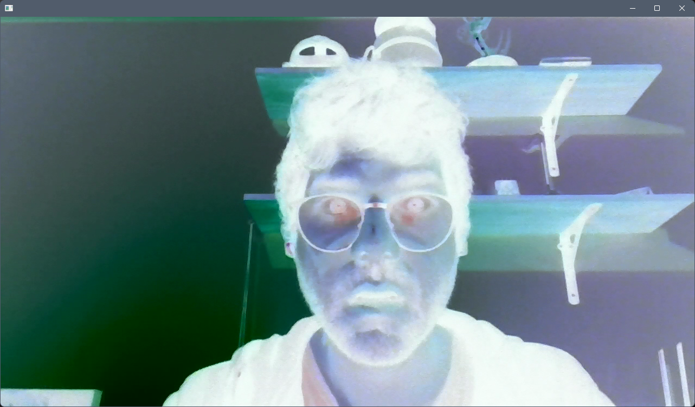
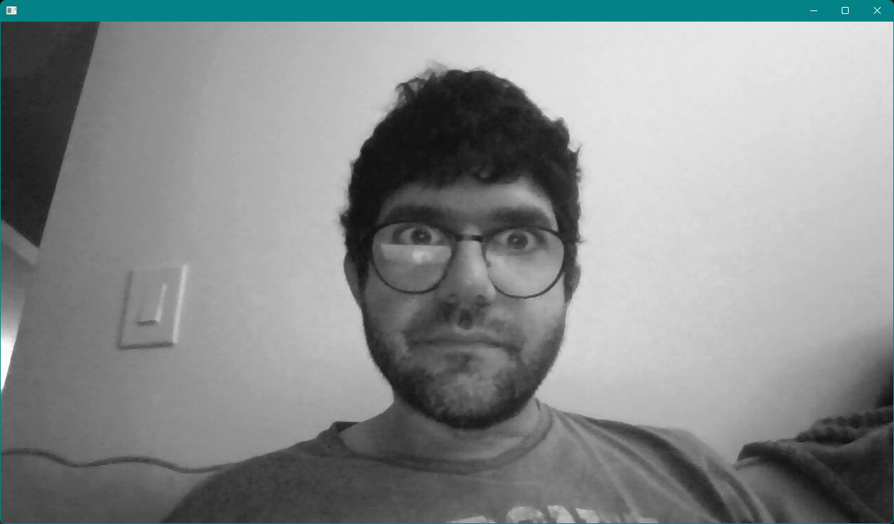

Computer vision allows computers to "see", and to understand what they are seeing. This is done by reading and interpreting digital images and video.

## Operations

What are some common computer vision operations?

* Image filtering
  * Convert from one color space to another (e.g. RGB to grayscale).
  * Adjust brightness and contrast.
  * Blur or sharpen the image.
  * Edge detection.



* Background subtraction
  * Detect moving objects by comparing them to a reference frame.



* Object recognition
  * Blob detection
  * Contour finding



* Motion estimation
  * Track pixel movement between consecutive frames and infer the direction objects are moving into.


  
* Face detection
  * Feature recognition
  * Smile detection



* Camera and projector calibration



<figure style="width:600px;height:400px;display:block;margin:0 auto;">
  <iframe width="600" height="375" src="https://www.youtube.com/embed/lX6JcybgDFo" frameborder="0" allow="accelerometer; autoplay; encrypted-media; gyroscope; picture-in-picture" allowfullscreen></iframe>
  <figcaption><i>Box by Bot & Dolly</i></figcaption>
</figure>

### Image Segmentation

One of the most common operations we will have to perform when working with computer vision is image segmentation. Image segmentation simply means dividing up the image pixels into meaningful groups. These meaningful groups depend on the application we are creating. For example, we may want to only consider the brightest pixels in an image, pixels of a certain color, clusters of pixels of a specific size, etc.

{{< image src="https://www.researchgate.net/profile/Gabriel_Sanchez-Perez/publication/220050099/figure/fig1/AS:277473016205312@1443166130542/Hand-shape-segmentation-grayscale-captured-image-and-its-corresponding-binary-segmented.png" alt="Shape-based hand recognition approach using the morphological pattern spectrum" caption="[*Shape-based hand recognition approach using the morphological pattern spectrum*](https://www.researchgate.net/publication/220050099_Shape-based_hand_recognition_approach_using_the_morphological_pattern_spectrum)" width="600px" >}}

Image segmentation is the first step into many applications as it is a way to discard unwanted data and only keep what we need to focus on.

## Video Capture

Let's begin with a simple app to stream data from a connected webcam.

We will use an [`ofVideoGrabber`](https://openframeworks.cc/documentation/video/ofVideoGrabber/) to capture frames from video.

```cpp
// ofApp.h
#pragma once

#include "ofMain.h"

class ofApp : public ofBaseApp
{
public:
  void setup();
  void update();
  void draw();

  ofVideoGrabber grabber;
};
```

```cpp
// ofApp.cpp
#include "ofApp.h"

void ofApp::setup()
{
  grabber.setup(1280, 720);
}

void ofApp::update()
{
  grabber.update();
}

void ofApp::draw()
{
  grabber.draw(0, 0, ofGetWidth(), ofGetHeight());
}
```

Note that we call the [`ofVideoGrabber::update()`](https://openframeworks.cc/documentation/video/ofVideoGrabber/#!show_update) function every frame. This method checks if there's a new video frame available and if so, refreshes the grabber to make it available.

We will use an [`ofImage`](https://openframeworks.cc/documentation/graphics/ofImage/) to store our thresholded image. Let's start with a stub procedure that just copies the video pixels into the image one at a time.

```cpp
// ofApp.h
#pragma once

#include "ofMain.h"

class ofApp : public ofBaseApp
{
public:
  void setup();
  void update();
  void draw();

  ofVideoGrabber grabber;
  ofImage resultImg;
};
```

```cpp
// ofApp.cpp
#include "ofApp.h"

void ofApp::setup()
{
  grabber.setup(1280, 720);
  resultImg.allocate(1280, 720, OF_IMAGE_COLOR);
}

void ofApp::update()
{
  grabber.update();

  ofPixels grabberPix = grabber.getPixels();
  ofPixels resultPix = resultImg.getPixels();
  for (int y = 0; y < grabberPix.getHeight(); y++)
  {
    for (int x = 0; x < grabberPix.getWidth(); x++)
    {
      ofColor pixColor = grabberPix.getColor(x, y);
      resultPix.setColor(x, y, pixColor);
    }
  }
}

void ofApp::draw()
{
  resultImg.draw(0, 0, ofGetWidth(), ofGetHeight());
}
```


Why is the drawn image not updating?

Remember that an `ofImage` is made up of two parts: [`ofPixels`](https://openframeworks.cc/documentation/graphics/ofPixels/), which is the data component of the image (on the CPU), and [`ofTexture`](https://openframeworks.cc/documentation/gl/ofTexture/), which is the graphics component of the image (on the GPU). For an image to get drawn to the screen, the data in `ofPixels` must be copied over to the `ofTexture`.

When manipulating pixels directly as we are doing, this process needs to be triggered manually by calling [`ofImage::update()`](https://openframeworks.cc/documentation/graphics/ofImage/#show_update).


### Pass by Reference vs. Pass by Value

You'll notice that our drawn image is still not working even after adding the call to `ofImage::update()`.

In C++, there are a few ways to pass data (aka arguments or parameters) between objects and functions. We can pass data by reference, by value, or by pointer.

* Pass by **reference** means that we are passing the actual data object itself. Any changes we make to the received object will be kept in the original reference, as it is the same object.
* Pass by **value** means that we are just passing the value of the data, not the data object itself. This means making a copy of the original object and passing that copy. This does not make a difference when the data is a number (like an `int` or a `float`) but it does matter when the data is an object, as any changes we make to the received object are only applied on this new copy object.
* Pass by **pointer** means that we are passing the memory address of the data object. We will look at this later on in the course.

By default, data is passed by **value** in C++.

In our app, the line `ofPixels resultPix = resultImg.getPixels();` creates a copy of the image pixels and stores it in `resultPix`. Any changes we make to `resultPix` are changes made on the copy and not on the `ofPixels` belonging to `resultImg`. This is why we are not seeing the image get updated.

One way to resolve this would be to save back the modified pixels to `resultImg` at the end of the loop:

```cpp
resultImg.setFromPixels(resultPix);
```

Our code finally works! However it is highly unoptimized as we are now making two additional copies of our pixel array every frame.

```cpp
// ofApp.cpp

// ...

void ofApp::update()
{
  grabber.update();

  ofPixels grabberPix = grabber.getPixels();
  ofPixels resultPix = resultImg.getPixels();  // COPY!
  for (int y = 0; y < grabberPix.getHeight(); y++)
  {
    for (int x = 0; x < grabberPix.getWidth(); x++)
    {
      ofColor pixColor = grabberPix.getColor(x, y);
      resultPix.setColor(x, y, pixColor);
    }
  }

  resultImg.setFromPixels(resultPix);  // COPY!
}

// ...
```

A better approach is to pass the original pixels by reference using the `&` operator. The reference `ofPixels` from the `ofImage` are then modified directly. We can even go ahead and pass the grabber pixels by reference and avoid making a copy there too.

```cpp
// ofApp.cpp
#include "ofApp.h"

void ofApp::setup()
{
  grabber.setup(1280, 720);
  resultImg.allocate(1280, 720, OF_IMAGE_COLOR);
}

void ofApp::update()
{
  grabber.update();

  // Use a reference to the ofPixels in both the grabber and the image.
  ofPixels& grabberPix = grabber.getPixels();
  ofPixels& resultPix = resultImg .getPixels();
  for (int y = 0; y < grabberPix.getHeight(); y++)
  {
    for (int x = 0; x < grabberPix.getWidth(); x++)
    {
      ofColor pixColor = grabberPix.getColor(x, y);
      resultPix.setColor(x, y, pixColor);
    }
  }

  // Update the internal texture (GPU) with the new pixel data.
  resultImg.update();
}

void ofApp::draw()
{
  resultImg.draw(0, 0, ofGetWidth(), ofGetHeight());
}
```



A negative of a pixel of color is the inverse of that color. Because every pixel channel's value has range `0`-`255`, the inverse is the value substracted from `255`.

```cpp
negCol.r = 255 - pixCol.r;
negCol.g = 255 - pixCol.g;
negCol.b = 255 - pixCol.b;
```

`ofColor` has an [`ofColor::invert()`](https://openframeworks.cc/documentation/types/ofColor/#show_invert) method which does this for us.

```cpp
// ofApp.cpp
#include "ofApp.h"

// ...

void ofApp::update()
{
  grabber.update();

  // Use a reference to the ofPixels in both the grabber and the image.
  ofPixels& grabberPix = grabber.getPixels();
  ofPixels& resultPix = resultImg.getPixels();
  for (int y = 0; y < grabberPix.getHeight(); y++)
  {
    for (int x = 0; x < grabberPix.getWidth(); x++)
    {
      ofColor pixColor = grabberPix.getColor(x, y);
      resultPix.setColor(x, y, pixColor.invert());
    }
  }
  // Update the internal texture (GPU) with the new pixel data.
  resultImg.update();
}

// ...
```





We have a few options that could work. In all cases, we need to convert the image from the 3 RGB channels into a single channel value.

* We could use the max value, called the *brightness*.

```cpp
unsigned char gray = max(pixColor.r, max(pixColor.g, pixColor.b));
```

* We could use the average value, called the *lightness*.

```cpp
unsigned char gray = (pixColor.r + pixColor.g + pixColor.b) / 3;
```

* We could calculate a weighted average, called the *luminance*. The following formula takes into account human eye perception, which is more sensitive to green.

```cpp
unsigned char gray = 0.21 * pixColor.r + 0.71 * pixColor.g + 0.07 * pixColor.b;
```

`ofColor` has [`ofColor::getBrightness()`](https://openframeworks.cc/documentation/types/ofColor/#show_getBrightness) and [`ofColor::getLightness()`](https://openframeworks.cc/documentation/types/ofColor/#show_getLightness) methods which can help.

```cpp
// ofApp.cpp
#include "ofApp.h"

// ...

void ofApp::update()
{
  grabber.update();

  // Use a reference to the ofPixels in both the grabber and the image.
  ofPixels& grabberPix = grabber.getPixels();
  ofPixels& resultPix = resultImg.getPixels();
  for (int y = 0; y < grabberPix.getHeight(); y++)
  {
    for (int x = 0; x < grabberPix.getWidth(); x++)
    {
      ofColor pixColor = grabberPix.getColor(x, y);
      resultPix.setColor(x, y, pixColor.getLightness());

      //unsigned char gray = 0.21 * pixColor.r + 0.71 * pixColor.g + 0.07 * pixColor.b; 
      //resultPix.setColor(x, y, gray);
    }
  }
  // Update the internal texture (GPU) with the new pixel data.
  resultImg.update();
}

// ...
```



## Thresholding

Thresholding is a simple segmentation technique where a pixel value is either on or off. If it is on we will color it white and if it is off we will color it black. Thresholded images can be used as masks into our input image, used to discard any pixels we want to ignore.

<figure style="width:600px;height:400px;display:block;margin:0 auto;">
<div style="padding:56.25% 0 0 0;position:relative;"><iframe src="https://player.vimeo.com/video/8525186" style="position:absolute;top:0;left:0;width:100%;height:100%;" frameborder="0" allow="autoplay; fullscreen" allowfullscreen></iframe></div><script src="https://player.vimeo.com/api/player.js"></script>
<figcaption><i><a href="https://vimeo.com/8525186">night lights</a> from <a href="https://vimeo.com/thesystemis">zach lieberman</a> on <a href="https://vimeo.com">Vimeo</a>.</i></figcaption>
</figure>

Let's write a simple thresholding algorithm that only keeps the brightest parts of an image. We will use the brightness of each pixel color to determine if it should be on or off in our result image.

```cpp
// ofApp.cpp
#include "ofApp.h"

void ofApp::setup()
{
  grabber.setup(1280, 720);
  resultImg.allocate(1280, 720, OF_IMAGE_COLOR);
}

void ofApp::update()
{
  grabber.update();

  int brightnessThreshold = 128;

  ofPixels& grabberPix = grabber.getPixels();
  ofPixels& resultPix = resultImg.getPixels();
  for (int y = 0; y < grabberPix.getHeight(); y++)
  {
    for (int x = 0; x < grabberPix.getWidth(); x++)
    {
      ofColor pixColor = grabberPix.getColor(x, y);
      if (pixColor.getBrightness() > brightnessThreshold)
      {
        // Set the pixel white if its value is above the threshold.
        resultPix.setColor(x, y, ofColor(255));
      }
      else
      {
        // Set the pixel black if its value is below the threshold.
        resultPix.setColor(x, y, ofColor(0));
      }
    }
  }
  resultImg.update();
}

void ofApp::draw()
{
  resultImg.draw(0, 0, ofGetWidth(), ofGetHeight());
}
```

We should make our threshold value editable, as we do not know what environment this app will run in.

Let's make `brightnessThreshold` a class variable by moving the declaration to the header file. We can then use the mouse position to adjust the value in every update loop. We will use the [`ofMap()`](https://openframeworks.cc/documentation/math/ofMath/#!show_ofMap) function to easily convert our mouse position (from 0 to the width of the window) to our brightness range (from `0` to `255`).

```cpp
// ofApp.h
#pragma once

#include "ofMain.h"

class ofApp : public ofBaseApp
{
public:
  void setup();
  void update();
  void draw();

  ofVideoGrabber grabber;
  ofImage resultImg;

  int brightnessThreshold;
};
```

```cpp
// ofApp.cpp
#include "ofApp.h"

void ofApp::setup()
{
  grabber.setup(1280, 720);
  resultImg.allocate(1280, 720, OF_IMAGE_COLOR);
}

void ofApp::update()
{
  grabber.update();

  brightnessThreshold = ofMap(mouseX, 0, ofGetWidth(), 255, 0);

  ofPixels& grabberPix = grabber.getPixels();
  ofPixels& resultPix = resultImg.getPixels();
  for (int y = 0; y < grabberPix.getHeight(); y++)
  {
    for (int x = 0; x < grabberPix.getWidth(); x++)
    {
      ofColor pixColor = grabberPix.getColor(x, y);
      if (pixColor.getBrightness() > brightnessThreshold)
      {
        // Set the pixel white if its value is above the threshold.
        resultPix.setColor(x, y, ofColor(255));
      }
      else
      {
        // Set the pixel black if its value is below the threshold.
        resultPix.setColor(x, y, ofColor(0));
      }
    }
  }
  resultImg.update();
}

void ofApp::draw()
{
  resultImg.draw(0, 0, ofGetWidth(), ofGetHeight());
}
```

This is functional, but the way we are setting the threshold is a little clunky. We want better control and feedback for our threshold variable, and we can do this by replacing the mouse position by a GUI with a slider.

We will achieve this using two new elements: the `ofxGui` addon and the `ofParameter` template class.

### ofxGui

The `ofxGui` addon ships with OF and is used for creating GUI elements.

"Addon" means it is not part of the OF core files. We need additional files in our project to use the addon. This can be complex if we do it manually, but thankfully we can select addons in the Project Generator and let it take care of the hard work.



When we regenerate our project files, we will now have access to all the `ofxGui` classes.

For this example, we will use [`ofxPanel`](https://openframeworks.cc/documentation/ofxGui/ofxPanel/), which is simply a container that can hold other GUI controls like buttons and sliders.

`ofxGui` cannot use data types like `int`, `float`, `string` directly, because it needs additional information like a name, a range, etc.

One option is to use special classes that are part of `ofxGui` like `ofxIntSlider`, `ofxColorSlider`, `ofxButton`, etc. The example `examples\gui\guiExample` demonstrates how to do this.

### ofParameter

Another option is to use a special OF class called [`ofParameter`](https://openframeworks.cc/documentation/types/ofParameter/). This is more useful because `ofParameter` objects have similar properties and can be used outside of `ofxGui`.

`ofParameter` is a **wrapper** class that is used to give other data types super powers. For example:

* Min and max values can be defined and the value will always stay within that range.
* A notification gets triggered whenever the value is changed. This is especially useful for GUIs where we need to respond right away when a variable changes.

`ofParameter` uses the template syntax, meaning that whatever type they hold is set between the `< >` symbols. In our case, since the threshold is an `int`, our `ofParameter` will be defined using `ofParameter<int>`.


**What is a template?**

C++ has a concept of [templates](https://en.cppreference.com/w/cpp/language/templates). The idea with templates is to use types as parameters, similar to how we use values as parameters. If a class is templated, it can work with various data types without having to write the same code multiple times.

We will usually see classes or functions be templated.

In fact, we have already been using templates with `ofPixels`! The `ofPixels` type is actually a [shorthand](https://github.com/openframeworks/openFrameworks/blob/master/libs/openFrameworks/graphics/ofPixels.h#L661) for `ofPixels_<unsigned char>`. This means it is an [`ofPixels_`](https://openframeworks.cc/documentation/graphics/ofPixels/#!show_ofPixels_) template where the data type of the pixels is `unsigned char` (and that is why our values go from `0` to `255`).

`ofPixels_` can also be used with `float` and `unsigned short` pixels, using `ofPixels_<float>` or `ofPixels_<unsigned short>`. The shorthands `ofFloatPixels` and `ofShortPixels` are also available, and they represent exactly the same thing.

`ofParameter` works in a similar way, it is a template class. We need to specify the type and precision of the data it will control, in this case `int`. This is done when declaring the variable with type `ofParameter<int>`.


Our code now looks like the following, and our app window has a slider in the top-left corner we can use to edit the threshold value.

```cpp
// ofApp.h
#pragma once

#include "ofMain.h"
#include "ofxGui.h"

class ofApp : public ofBaseApp
{
public:
  void setup();
  void update();
  void draw();

  ofVideoGrabber grabber;
  ofImage resultImg;

  ofParameter<int> brightnessThreshold;

  ofxPanel guiPanel;
};
```

```cpp
// ofApp.cpp
#include "ofApp.h"

void ofApp::setup()
{
  grabber.setup(1280, 720);
  resultImg.allocate(1280, 720, OF_IMAGE_COLOR);

  // Initialize the threshold parameter with range [0, 255].
  brightnessThreshold.set("Bri Thresh", 120, 0, 255);

  // Setup the GUI panel and add the threshold parameter.
  guiPanel.setup("Threshold");
  guiPanel.add(brightnessThreshold);
}

void ofApp::update()
{
  grabber.update();

  ofPixels& grabberPix = grabber.getPixels();
  ofPixels& resultPix = resultImg.getPixels();
  for (int y = 0; y < grabberPix.getHeight(); y++)
  {
    for (int x = 0; x < grabberPix.getWidth(); x++)
    {
      ofColor pixColor = grabberPix.getColor(x, y);
      if (pixColor.getBrightness() > brightnessThreshold)
      {
        // Set the pixel white if its value is above the threshold.
        resultPix.setColor(x, y, ofColor(255));
      }
      else
      {
        // Set the pixel black if its value is below the threshold.
        resultPix.setColor(x, y, ofColor(0));
      }
    }
  }
  resultImg.update();
}

void ofApp::draw()
{
  resultImg.draw(0, 0, ofGetWidth(), ofGetHeight());

  guiPanel.draw();
}
```

## Background Subtraction

Background subtraction is a segmentation technique where the background pixels of an image are removed, leaving only the foreground data for processing.


**What defines the background?**

This varies depending on the type of sensor used, the environment, and the application.

When using a depth sensor, we can actually use a pixel's distance from the camera to determine if it's in the background or not. In general for 2D video, a background pixel is one that is considered *stable*, i.e. that does not change its value much or at all.


Background subtraction requires that we have a background frame as a reference. We can do this by saving a video frame in memory, and comparing future frames to it in our `update()` loop.

Video pixel values change slightly over time, so we cannot expect them to be identical frame by frame. We will add a threshold value and compare the difference between the pixels to determine if it should be on or off.

```cpp
// ofApp.h
#pragma once

#include "ofMain.h"
#include "ofxGui.h"

class ofApp : public ofBaseApp
{
public:
  void setup();
  void update();
  void draw();

  ofVideoGrabber grabber;
  ofImage backgroundImg;
  ofImage resultImg;

  ofParameter<bool> captureBackground;
  ofParameter<int> colorThreshold;

  ofxPanel guiPanel;
};
```

```cpp
// ofApp.cpp
#include "ofApp.h"

void ofApp::setup()
{
  grabber.setup(1280, 720);
  resultImg.allocate(1280, 720, OF_IMAGE_COLOR);

  captureBackground.set("Capture BG", true);
  colorThreshold.set("Color Thresh", 120, 0, 255);

  guiPanel.setup("BG Subtraction");
  guiPanel.add(captureBackground);
  guiPanel.add(colorThreshold);
}

void ofApp::update()
{
  grabber.update();

  ofPixels& grabberPix = grabber.getPixels();

  if (captureBackground)
  {
    backgroundImg.setFromPixels(grabber.getPixels());
    captureBackground = false;
  }

  ofPixels& resultPix = resultImg.getPixels();
  for (int y = 0; y < grabberPix.getHeight(); y++)
  {
    for (int x = 0; x < grabberPix.getWidth(); x++)
    {
      ofColor grabColor = grabberPix.getColor(x, y);
      ofColor bgColor = backgroundImg.getColor(x, y);
      if (abs(grabColor.r - bgColor.r) > colorThreshold ||
          abs(grabColor.g - bgColor.g) > colorThreshold ||
          abs(grabColor.b - bgColor.b) > colorThreshold)
      {
        resultPix.setColor(x, y, grabColor);
      }
      else
      {
        resultPix.setColor(x, y, ofColor(0));
      }
    }
  }
  resultImg.update();
}

void ofApp::draw()
{
  resultImg.draw(0, 0, ofGetWidth(), ofGetHeight());

  guiPanel.draw();
}
```

## Devices

### Color

While using built-in webcams is convenient for testing, it is not a great choice for deployed projects. They tend to be low quality and not offer manual controls for white balance, exposure, focus, etc.

* Higher end webcams like the [Logitech C9XX or Brio series](https://www.logitech.com/en-us/products/webcams.html) are a good alternative.
* For best quality, a DSLR or video camera can be used with a capture card, like the [Blackmagic UltraStudio Recorder 3G](https://www.blackmagicdesign.com/products/ultrastudio).

### Infrared

Depending on the application and environment, it might be better to use an alternative to a color camera for capturing images.

Infrared cameras are often used for sensing because they see light that is invisible to humans. They tend to be a more versatile choice as they can be used in a bright room, a pitch dark room, facing a video projector, behind a touch surface, etc.

<figure style="width:600px;height:490px;display:block;margin:0 auto;">
<div style="padding:75% 0 0 0;position:relative;"><iframe src="https://player.vimeo.com/video/283105" style="position:absolute;top:0;left:0;width:100%;height:100%;" frameborder="0" allow="autoplay; fullscreen" allowfullscreen></iframe></div><script src="https://player.vimeo.com/api/player.js"></script>
<figcaption><i><a href="https://vimeo.com/283105">presence [a.k.a soft &amp; silky]</a> from <a href="https://vimeo.com/smallfly">smallfly</a> on <a href="https://vimeo.com">Vimeo</a>.</i></figcaption>
</figure>

Infrared USB cameras can be hard to come by.

* One option is to get a depth sensor like an [Intel RealSense](https://www.intelrealsense.com/). Most of these also include an IR light emitter, which means it will always have enough light to work properly.
* Another popular option is to "hack" regular color cameras by adding a piece of processed film in front of the lens (which acts as an IR filter). There are a few [tutorials](https://www.instructables.com/id/Infrared-IR-Webcam/) on Instructables for doing this. A popular device for this hack is the [PS3 Eye](http://wiki.lofarolabs.com/index.php/Removing_the_IR_Filter_from_the_PS3_Eye_Camera) camera.
* Finally, we can opt for [security cameras](https://duckduckgo.com/?q=security+camera&t=ffab&iax=images&ia=images). These tend to have emitters around the lens to ensure there is enough light for the sensor. However, the quality is not great and they usually do not have USB connectivity and will require an adapter.

Thermographic cameras, commonly known as FLIR, can be an interesting option. These infrared cameras sense radiation/heat and represent it as a color map. This can be very useful for tracking humans or animals as they can easily be segmented from their surroundings.

<figure style="width:600px;display:block;margin:0 auto;">
<iframe width="560" height="315" src="https://www.youtube.com/embed/5gqVf_rLfn4" frameborder="0" allow="accelerometer; autoplay; encrypted-media; gyroscope; picture-in-picture" allowfullscreen></iframe>
<figcaption><i><a href="https://www.youtube.com/embed/5gqVf_rLfn4">AGGRO DR1FT Teaser Trailer #1</a></i></figcaption>
</figure>
